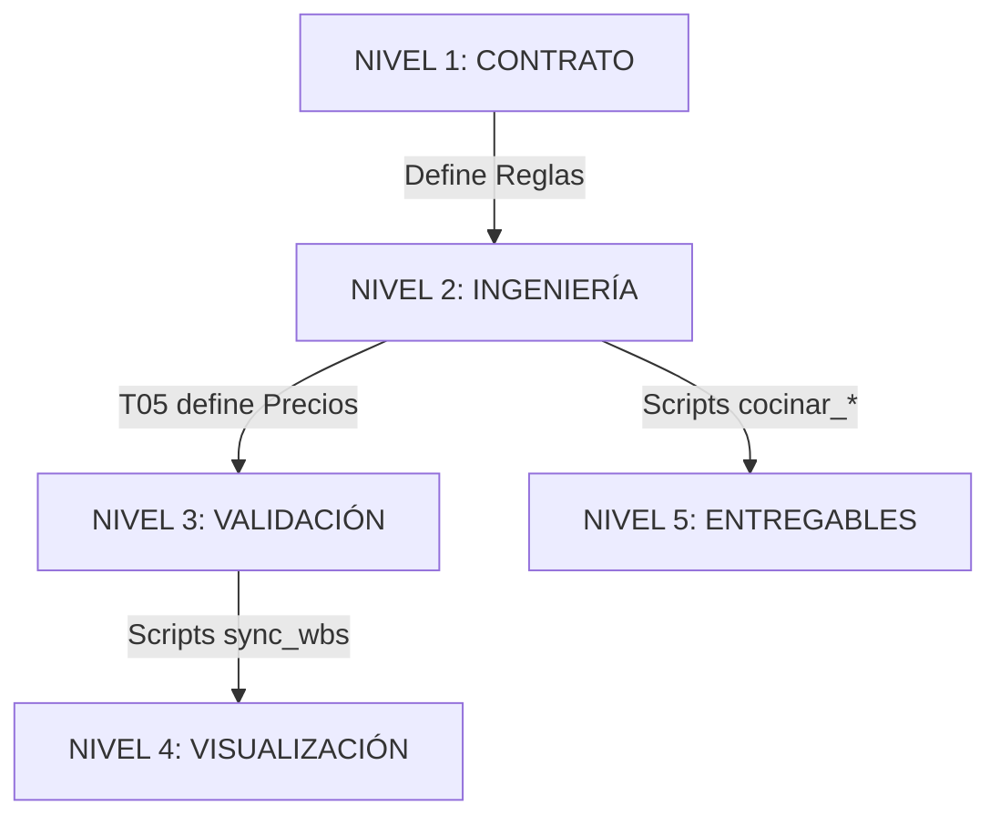

# GUÍA METODOLÓGICA: ESTRUCTURACIÓN DE PROYECTOS EPC FERROVIARIOS
## Versión 1.0 - Basada en Proyecto APP La Dorada-Chiriguaná

**Versión:** 1.0  
**Fecha:** Enero 2025  
**Proyecto Base:** APP La Dorada-Chiriguaná  
**Propósito:** Documento maestro para estructurar proyectos EPC ferroviarios de forma sistemática y replicable

---

## 🎯 OBJETIVO DE ESTE DOCUMENTO

Esta guía te permitirá:

1. **Finalizar la Metodología de Estructuración** (basada en Proyecto La Dorada-Chiriguaná)
2. **Construir e iterar la Guía Metodológica** de forma continua
3. **Definir estructura de trabajo** (I-VII) y entregable (IX)
4. **Producir documentación** de Ingeniería Conceptual, Básica y Detalle
5. **Consolidar todo en carpeta IX** como producto final

---

## 📚 SECCIÓN 1: MARCO DE TRABAJO

### 1.1 Filosofía "Contract-First"
La estructuración no es solo documentación; es un **Sistema de Defensa Contractual**. 
> "El Contrato es la constitución. La Ingeniería es la ley. El Código es la ejecución."

**¿Qué estás construyendo?**


**Arquitectura de 5 Capas (Data Pipeline):**
1. **CAPA 1: CONTRATO (Inmutable):** Apéndices Técnicos (AT1-AT4). La verdad legal.
2. **CAPA 2: INGENIERÍA (T01-T05):** De la Ficha al Precio. La verdad técnica.
3. **CAPA 3: VALIDACIÓN:** Scripts y transformaciones JSON. La verdad del dato.
4. **CAPA 4: VISUALIZACIÓN:** Interfaces Web / Dashboards. La verdad visual.
5. **CAPA 5: SERVICIOS:** RFQs, Ejecutivos y entregables finales. El producto servido.

### 1.2 Principios Rectores

#### ✅ Principio 1: Documentar mientras ejecutas
- Cada decisión debe capturarse en la Guía Metodológica
- No esperes al final para documentar
- Usa plantilla de "Lección Aprendida"

#### ✅ Principio 2: Iterar constantemente
- La Guía Metodológica es un documento vivo
- Cada semana, dedica 2 horas a actualizarla
- Registra cambios en el CHANGELOG

#### ✅ Principio 3: Separar trabajo de entregable
- I-VII = Carpetas de trabajo (experimentación)
- IX = Carpeta de entregable (producto consolidado)
- No mezclar ambas lógicas

#### ✅ Principio 4: Metodología Punto 42 siempre
- Todo documento debe pasar por los 5 pilares
- Usar checklist de validación Punto 42

---

## 📋 SECCIÓN 2: ROADMAP DE EJECUCIÓN (11 SEMANAS)

### FASE 0: PREPARACIÓN Y SETUP (Semana 1)

**Objetivos:**
- Configurar estructura de carpetas
- Leer y entender documentos base
- Crear índices preliminares

**Actividades Paso a Paso:**

#### DÍA 1-2: Lectura Contractual Inmersiva

**CHECKLIST - LECTURA CONTRACTUAL:**
- [ ] Lectura 1 del Contrato General (velocidad: captar estructura)
  └─ Anotar: Capítulos principales, obligaciones generales
- [ ] Lectura 2 del Contrato General (velocidad: profundizar)
  └─ Marcar: Cláusulas críticas, plazos, penalizaciones
- [ ] Listar todos los Apéndices Técnicos disponibles
  └─ Crear tabla: Nombre, Tema, Páginas, Prioridad
- [ ] Lectura rápida de cada Apéndice (15 min c/u)
  └─ Captar: Qué sistema/especialidad cubre cada uno

**ENTREGABLE DÍA 2:**
└─ Archivo: `I/00_Indice_Documentos_Base.md`
   Contenido:
   - Lista de documentos contractuales
   - Tabla de Apéndices con resumen
   - Identificación de sistemas mencionados

#### DÍA 3: Crear Estructura de Carpetas

```bash
# Script para crear estructura base:
mkdir -p I_CONTRACTUAL/{Contrato,Apendices,Analisis}
mkdir -p II_REFERENCIAS/{Normativas,Estandares,BestPractices}
mkdir -p III_CONCEPTUAL/{Sistemas,Especialidades,Integracion}
mkdir -p IV_BASICA/{Sistemas,Especialidades,Especificaciones}
mkdir -p V_DETALLE/{Sistemas,Especialidades,Planos}
mkdir -p VI_OPERACION/{OyM,Procedimientos,Manuales}
mkdir -p VII_GESTION/{PMO,Riesgos,Interfaces}
mkdir -p IX_ENTREGABLES/{SISTEMAS,ESPECIALIDADES,GESTION,MATRICES,INDICES}
mkdir -p METODOLOGIA/{Guia,Templates,Lecciones,Checklists}
```

**CHECKLIST - ESTRUCTURA DE CARPETAS:**
- [ ] Crear todas las carpetas según script
- [ ] Crear README.md en cada carpeta explicando su propósito
- [ ] Crear archivo .gitkeep para mantener carpetas vacías en Git
- [ ] Documentar nomenclatura de archivos en `I/00_Nomenclatura.md`

**ENTREGABLE DÍA 3:**
└─ Estructura de carpetas completa
└─ Archivo: `I/00_Nomenclatura.md`

#### DÍA 4-5: Crear WBS Preliminar

**CHECKLIST - WBS PRELIMINAR:**
- [ ] Extraer del Contrato: Alcances principales del proyecto
- [ ] Identificar "paquetes de trabajo" mencionados
- [ ] Crear desglose de 3 niveles:
  - Nivel 1: Sistemas principales (ej: Control, Telecomunicaciones)
  - Nivel 2: Subsistemas (ej: CTC, TETRA)
  - Nivel 3: Componentes (ej: Servidores CTC, Estaciones Base TETRA)
- [ ] Crear diagrama WBS visual (usar Mermaid o Excel)

**EJEMPLO WBS:**
```
1.0 PROYECTO LA DORADA-CHIRIGUANÁ
  1.1 SISTEMAS DE CONTROL Y SEÑALIZACIÓN
    1.1.1 CTC (Control de Tráfico Centralizado)
      1.1.1.1 Centro de Control
      1.1.1.2 Enclavamientos
      1.1.1.3 Software CTC
    1.1.2 ITCS/ETCS
      1.1.2.1 Sistema embarcado
      1.1.2.2 Sistema en tierra (RBC)
    1.1.3 Señalización
      1.1.3.1 Señales luminosas
      1.1.3.2 Señales mecánicas
  1.2 SISTEMAS DE TELECOMUNICACIONES
    [...]
```

**Entregables de Semana 1:**
- ✅ `I/00_Indice_Documentos_Base.md`
- ✅ `I/00_Nomenclatura.md`
- ✅ Estructura de carpetas completa
- ✅ `VII/WBS_Preliminar_v0.1.md`
- ✅ `METODOLOGIA/Guia/00_Log_Semana_1.md`

---

## 📋 SECCIÓN 3: METODOLOGÍA PUNTO 42 APLICADA

### 3.1 Los 5 Pilares Evolucionados (Phase 7)

#### 1️⃣ INGENIERÍA DEFENSIVA (T04)
- **"Una especificación sin causales de rechazo es solo una sugerencia."**
- Cada parámetro técnico debe citar su Fuente de Obligación (Manual, Norma, Contrato).

#### 2️⃣ COHERENCIA NARRATIVA (Anti-Ghost Data)
- Validación cruzada para eliminar contradicciones entre texto descriptivo y tablas de cantidades (T05).
- El dato manda sobre el relato.

#### 3️⃣ SMART CAPEX OPTIMIZATION
- **Zero Infrastructure:** Priorizar infraestructura propia.
- **Zero Civil Works:** Preferir soluciones inalámbricas/superficiales.
- **Unified Services:** Eliminar redundancias de integración.

#### 4️⃣ TRAZABILIDAD DINÁMICA
- Cada ítem del WBS debe nacer en un T05 y visualizarse en el Dashboard.
- Sincronización automática vía scripts (Layer 3).

#### 5️⃣ NEUTRALIDAD TÉCNICA
- Especificaciones basadas en desempeño y cumplimiento contractual, no en marcas o tecnologías prescriptivas no acordadas.

### 3.2 Checklist de Validación Punto 42

**CHECKLIST GENERAL PARA CIERRE DE SISTEMA (PHASE 7):**
- [ ] **Análisis Contractual (L1):** ¿El diseño es neutral o prescribe tecnologías no pactadas?
- [ ] **Trazabilidad L1-L2:** ¿Cada parámetro de la Spec (T04) cita una cláusula del Contrato (AT)?
- [ ] **Ingeniería Defensiva (T04):** ¿Contiene cláusulas de rechazo explícitas ante incumplimiento?
- [ ] **Coherencia Narrativa:** ¿El relato del T01 coincide exactamente con las cantidades del T05?
- [ ] **Hard Deck Check (L3):** ¿Los valores del T05 están sincronizados con el Dashboard Web?
- [ ] **Smart CAPEX:** ¿Se agotaron las opciones de "Zero Civil Works" antes de proponer canalizaciones?

---

## 📋 SECCIÓN 3.3: PROTOCOLO DE VALIDACIÓN AGENTE 3 (CROSS-CHECK)

Para certificar el despliegue a producción (Layer 4/5), se debe ejecutar una **Validación Cruzada de Coherencia**:

1. **Coherencia de Arquitectura:** Verificar que README, Roadmap y Metodología mencionen "5 Capas".
2. **Coherencia de Datos Hard Deck:** Verificar que los valores en T05 coincidan exactamente con el Dashboard Web y el Índice Maestro.
3. **Coherencia Narrativa:** Escanear secciones manuales para eliminar "Ghost Data" (datos fantasmas en el texto que contradicen las tablas).
4. **Criterio de Aprobación:** 
   - ✅ **APROBADO:** Todos los valores coinciden entre documentos.
   - ❌ **RECHAZADO:** Cualquier discrepancia bloquea el cierre del sistema.

---

## 📋 SECCIÓN 4: TEMPLATES CLAVE

### 4.1 Template: Ficha de Sistema

```markdown
# [CÓDIGO WBS] T01 - FICHA DE SISTEMA: [NOMBRE]

## 1. IDENTIFICACIÓN
- **Código WBS:** [ej: 2.1.1]
- **Categoría:** [Sistemas / Infraestructura / Gestión]
- **Estado:** [Propuesta Técnica / Estudio de Referencia / En Re-lineación]

## 2. REFERENCIAS CONTRACTUALES (FUENTES DE VERDAD)
| Apéndice | Título | Sección | Requisito Clave |
|:---------|:-------|:--------|:----------------|
| AT1      | Alcance| 4.2     | Cantidad de unidades |
| AT4      | KPIs   | 3.1     | Disponibilidad 99.5%|

## 3. RESUMEN EJECUTIVO (EL RELATO)
[Descripción conceptual del sistema. DEBE ser coherente con el T05. Evitar datos "fantasmas"].

## 4. T02 - ANÁLISIS DE REQUISITOS
- **Funcionales:** [Listado trazable]
- **No Funcionales:** [Disponibilidad, Ciberseguridad, Mantenibilidad]

## 5. T03 - ARQUITECTURA CONCEPTUAL
[Diagramas de bloques y topología lógica].

## 6. PRÓXIMOS PASOS
- [ ] Validar con T05 de Precios.
- [ ] Ejecutar Sincronización Layer 3.
```

### 4.2 Template: Documento Master de Sistema

```markdown
# [CÓDIGO WBS] T04 - ESPECIFICACIÓN TÉCNICA DEFENSIVA: [NOMBRE]

> [!WARNING]
> **AVISO AL OFERENTE:** El incumplimiento de cualquiera de los parámetros "Mandatorios" citados textualmente del Contrato será causa de rechazo inmediato de la propuesta sin lugar a subsanación técnica.

## 1. PARÁMETROS TÉCNICOS BINDING (AT3/AT4)
| Parámetro | Requisito | Fuente Contractual | Causal de Rechazo |
|:----------|:----------|:-------------------|:------------------|
| Disponibilidad | 99.5% | AT4, Sección 2.1.2| Inferior a 99.5% |
| Protocolo | Abierto/Neutral | AT2, Cláusula 14.2| Protocolo Propietario|

## 2. T05 - INGENIERÍA DE DETALLE (PRECIOS Y CANTIDADES)
| Ítem | Descripción | Unidad | Cantidad | Fuente de Cantidad |
|:-----|:------------|:-------|:---------|:-------------------|
| 1.01 | Hardware [X] | UN | [N] | AT1 / Diseño Opt. |

## 3. CERTIFICACIÓN DE COHERENCIA
- [ ] **Sincronizado con Dashboard:** Sí
- [ ] **Validado contra AT Literal:** Sí
- [ ] **Firma de Responsabilidad:** Ing. [Nombre]
```

---

## 📋 SECCIÓN 5: PROCESO DE DOCUMENTACIÓN CONTINUA

### 5.1 Protocolo de Documentación Semanal

**CADA VIERNES (2 horas dedicadas):**

#### PASO 1: Crear Log de Semana (30 min)
Archivo: `METODOLOGIA/Lecciones/Log_Semana_[NN].md`

**TEMPLATE - LOG SEMANAL:**
```markdown
# LOG SEMANAL - SEMANA [NN]

**Fecha:** [DD/MM/AAAA - DD/MM/AAAA]  
**Fase:** [Fase actual del roadmap]  
**Documentos producidos:** [Lista]

## 1. ACTIVIDADES REALIZADAS
- [Actividad 1]: [Descripción breve]
- [Actividad 2]: [Descripción breve]

## 2. DECISIONES TÉCNICAS TOMADAS
### Decisión 1: [Título]
- **Contexto:** [Por qué se necesitaba decidir]
- **Opciones evaluadas:**
  1. Opción A: [Descripción] - Ventajas/Desventajas
  2. Opción B: [Descripción] - Ventajas/Desventajas
- **Decisión:** [Opción seleccionada]
- **Justificación:** [Por qué se eligió]
- **Impacto:** [Qué afecta esta decisión]
- **Replicabilidad:** [¿Se aplica a proyectos futuros?]

## 3. PROBLEMAS ENCONTRADOS Y SOLUCIONES
### Problema 1: [Título]
- **Descripción:** [Qué problema se encontró]
- **Impacto:** [Cómo afectó el trabajo]
- **Solución aplicada:** [Cómo se resolvió]
- **Lección aprendida:** [Qué hacer en el futuro]
- **Prevención:** [Cómo evitarlo en próximos proyectos]

## 4. PLANTILLAS/HERRAMIENTAS CREADAS
- [Template/Tool 1]: [Ubicación] - [Propósito]

## 5. BLOQUES REUTILIZABLES IDENTIFICADOS
- [Bloque 1]: [Descripción] - [Dónde se aplicó] - [Reusabilidad %]

## 6. AJUSTES A LA METODOLOGÍA
- [Ajuste 1]: [Qué se cambió en el proceso] - [Por qué]

## 7. MÉTRICAS DE LA SEMANA
- Documentos completados: [N]
- Tiempo estimado vs. real: [X hrs vs. Y hrs]
- Nivel de reuso alcanzado: [% de contenido reutilizado]
- Dificultad percibida: [1-5]

## 8. PRÓXIMA SEMANA
- [ ] Tarea 1
- [ ] Tarea 2
- [ ] Puntos de atención especial
```

#### PASO 2: Actualizar Guía Metodológica (1 hora)
SI durante la semana:
- Creaste un nuevo template → Agregarlo a `METODOLOGIA/Templates/`
- Identificaste un bloque reutilizable → Agregarlo a `METODOLOGIA/Biblioteca/`
- Cambiaste el proceso → Actualizar `METODOLOGIA/Guia/[Fase].md`
- Aprendiste algo importante → Agregarlo a lecciones

#### PASO 3: Crear/Actualizar Templates y Bloques (30 min)
SI creaste un template nuevo durante la semana:
- Limpiarlo (quitar contenido específico del proyecto)
- Generalizarlo (variables en [CORCHETES])
- Agregar sección "Instrucciones de uso"
- Guardarlo en `METODOLOGIA/Templates/`

---

## 📋 SECCIÓN 6: KIT DE ARRANQUE PARA NUEVOS PROYECTOS

### 6.1 Estructura del Kit de Arranque

```
METODOLOGIA/Kit_Arranque_Proyecto_Nuevo/
├── README_Como_Usar_Este_Kit.md
├── 00_Checklist_Inicio_Proyecto.md
├── 01_Estructura_Carpetas.sh (script para crear carpetas)
├── 02_Templates_Listos/
│   └── [Todos los templates validados]
├── 03_Biblioteca_Bloques/
│   └── [Todos los bloques reutilizables]
├── 04_Guia_Metodologica_Completa.pdf
├── 05_Matriz_Estimacion_Tiempos.xlsx
└── 06_Ejemplos_Proyecto_1/
    └── [Documentos de ejemplo del Proyecto 1]
```

### 6.2 Checklist de Inicio de Proyecto Nuevo

**CHECKLIST: INICIO DE PROYECTO NUEVO**

**Proyecto:** [Nombre]  
**Responsable:** [Nombre]  
**Fecha inicio:** [DD/MM/AAAA]

#### PRE-PROYECTO (Semana -1)
- [ ] Clonar estructura de carpetas (ejecutar script)
- [ ] Copiar templates a ubicaciones correspondientes
- [ ] Configurar herramientas (Git, Markdown editor, etc.)
- [ ] Crear repositorio del proyecto
- [ ] Recibir Contrato de Concesión
- [ ] Recibir todos los Apéndices Técnicos
- [ ] Asignar líder técnico
- [ ] Asignar especialistas por sistema
- [ ] Capacitar equipo en Metodología Punto 42

#### SEMANA 1: PREPARACIÓN
- [ ] Lectura 1 de Contrato completo
- [ ] Lectura 2 de Contrato (profunda)
- [ ] Lectura rápida de Apéndices
- [ ] Crear `I/00_Indice_Documentos_Base.md`
- [ ] Validar estructura de carpetas creada
- [ ] Crear `I/00_Nomenclatura.md`
- [ ] Identificar sistemas principales
- [ ] Crear WBS de 3 niveles
- [ ] Crear `VII/WBS_Preliminar_v0.1.md`
- [ ] Comparar con WBS de Proyecto 1 (similitudes)

#### ESTIMACIÓN DE REUSO
| Sistema Proyecto Nuevo | Equivalente Proyecto 1 | Reuso Estimado |
|:-----------------------|:-----------------------|:---------------|
| [Sistema 1] | CTC | 70% |
| [Sistema 2] | TETRA | 80% |
| [...] | | |

**CRONOGRAMA AJUSTADO:**
Si Proyecto 1 tomó 11 semanas y reuso promedio es 60%:
└─ Proyecto Nuevo estimado: 11 × (1 - 0.60 × 0.7) = ~6 semanas

---

## 📋 SECCIÓN 7: LECCIONES APRENDIDAS DEL PROYECTO LA DORADA-CHIRIGUANÁ

### 7.1 Lecciones Clave Identificadas

#### L1: Análisis de Requisitos antes de Arquitectura
- **Categoría:** Secuencia de trabajo
- **Lección:** Hacer análisis detallado de requisitos antes de proponer arquitectura reduce retrabajos
- **Impacto:** Se actualizó Fase 2 de la Guía para hacer análisis de requisitos como paso obligatorio previo
- **Aplicabilidad:** ALTA - Aplica a cualquier sistema
- **Recomendación:** En proyectos futuros, hacer análisis de requisitos completo antes de proponer arquitectura

#### L2: Validación cruzada de interfaces semanalmente
- **Categoría:** Coordinación técnica
- **Lección:** Validación semanal durante desarrollo evita retrabajos vs. validación al final
- **Impacto:** Se agregó paso de "Validación de interfaces" cada viernes en Fase 2
- **Aplicabilidad:** ALTA
- **Recomendación:** Dedicar 2 horas cada viernes a revisar interfaces entre sistemas

#### L3: Template de Ficha de Sistema como primer paso
- **Categoría:** Herramientas
- **Lección:** Usar template T01_Ficha_Sistema.md como primer documento acelera extracción de requisitos.
- **Evidencia:** Se usó en 8 sistemas con éxito.
- **Eficiencia:** Reduce 30% el tiempo vs. formato libre.

#### L4: Saneamiento de "Ghost Data" (Audit 6.0)
- **Categoría:** Integridad del Dato.
- **Lección:** El texto descriptivo a menudo retiene cantidades obsoletas (ej. "30 cámaras") mientras la tabla T05 se actualiza (ej. "9 cámaras").
- **Solución:** Implementar la **Validación Agente 3** (Cross-Check) como requisito de cierre. El dato de la tabla subyace a la narrativa.

### 7.2 Métricas de Eficiencia Alcanzadas

| Métrica | Semana 1 | Semana 4 | Semana 8 | Mejora |
|:--------|:---------|:---------|:---------|:-------|
| Tiempo/Sistema Conceptual | 3 días | 2 días | 1.5 días | 50% |
| Reuso de bloques | 0% | 30% | 60% | +60pp |
| Errores de trazabilidad | 8 | 3 | 1 | -87% |

### 7.3 Estimación de Ahorro para Proyectos Futuros

**Estimación de ahorro para Proyecto 2:**
- Fase 0 (Preparación): -40% tiempo (templates listos)
- Fase 1 (Análisis): -30% tiempo (proceso optimizado)
- Fase 2 (Conceptual): -50% tiempo (bloques reutilizables)
- Fase 3 (Básica): -40% tiempo (especificaciones base)
- Fase 4 (Consolidación): -60% tiempo (estructura validada)

**AHORRO TOTAL ESTIMADO: 45% (~5 semanas de 11)**

---

## 📋 SECCIÓN 8: PRÓXIMOS PASOS Y MANTENIMIENTO

### 8.1 Ciclo de Mejora Continua

**SEMANAL (Viernes, 2 horas):**
- Crear log semanal
- Documentar lecciones aprendidas inmediatas
- Actualizar templates si se modificaron
- Agregar bloques reutilizables identificados

**MENSUAL (Última semana, 4 horas):**
- Consolidar lecciones del mes
- Actualizar procesos en Guía Metodológica
- Revisar métricas de eficiencia
- Ajustar estimaciones para próximos proyectos
- Actualizar biblioteca de bloques

**POST-PROYECTO:**
- Retrospectiva completa
- Análisis de métricas vs. estimaciones
- Extracción de bloques finales
- Guía Metodológica versión estable
- Kit de arranque para proyecto siguiente

### 8.2 Versionado de la Guía Metodológica

**CONVENCIÓN DE VERSIONADO:**
FORMATO: vX.Y.Z

- X = Versión MAYOR (cambios estructurales)
- Y = Versión MENOR (mejoras y adiciones)
- Z = Parche (correcciones y ajustes menores)

**EJEMPLOS:**
- v1.0.0 - Versión inicial basada en Proyecto La Dorada-Chiriguaná
- v1.1.0 - Agregado proceso de Ingeniería de Detalle
- v1.1.1 - Corrección de template de especificación
- v2.0.0 - Reestructuración mayor basada en múltiples proyectos

---

## ✅ CONCLUSIÓN

Esta Guía Metodológica representa el conocimiento consolidado del Proyecto APP La Dorada-Chiriguaná, transformado en un proceso replicable para futuros proyectos EPC ferroviarios.

**LOGROS PRINCIPALES:**
- ✅ Metodología sistemática de 11 semanas validada
- ✅ Templates y bloques reutilizables identificados
- ✅ Proceso de documentación continua establecido
- ✅ Kit de arranque para nuevos proyectos creado
- ✅ Estimación de 45% ahorro de tiempo en proyectos futuros

**PRÓXIMO PASO:**
Aplicar esta guía en el siguiente proyecto EPC ferroviario, documentando lecciones aprendidas y actualizando la metodología para lograr una mejora continua.

---

**Documento elaborado según Metodología Punto 42**  
**Fecha:** Febrero 2026  
**Estado:** ⚠️ **EN RE-LINEACIÓN (PHASE 7)**  
**Responsable:** Administrador Contractual EPC
