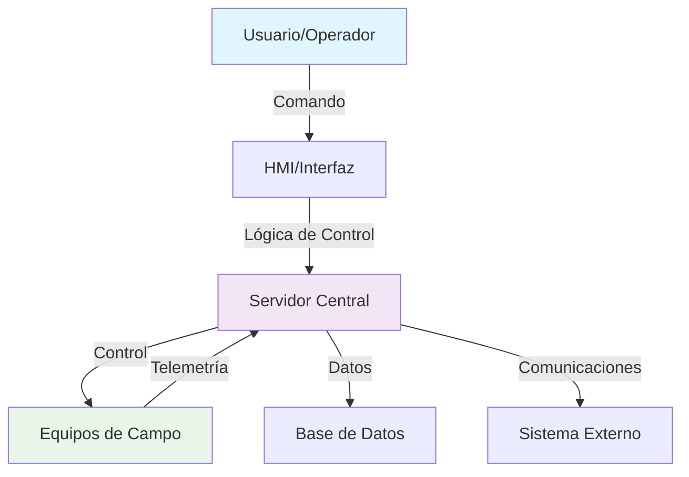

# TEMPLATE T03: ARQUITECTURA CONCEPTUAL

**Archivo:** `METODOLOGIA/Templates/T03_Arquitectura_Conceptual.md`

```markdown
# ARQUITECTURA CONCEPTUAL: [SISTEMA]

**Proyecto:** [NOMBRE_PROYECTO]  
**Sistema:** [NOMBRE_SISTEMA]  
**Fecha:** [DD/MM/AAAA]  
**Responsable:** [NOMBRE]  
**Estado:** [Draft/Review/Approved]

---

## 1. VISIÓN GENERAL

### 1.1 Descripción de la Solución
[Descripción en 2-3 párrafos de la solución propuesta, incluyendo objetivo principal y enfoque general]

### 1.2 Objetivos de la Arquitectura
- [Objetivo 1]: [Descripción]
- [Objetivo 2]: [Descripción]
- [Objetivo 3]: [Descripción]

### 1.3 Principios de Diseño
- [Principio 1]: [Descripción y justificación]
- [Principio 2]: [Descripción y justificación]
- [Principio 3]: [Descripción y justificación]

---

## 2. ARQUITECTURA FUNCIONAL

### 2.1 Diagrama de Bloques Funcional


**Explicación del diagrama:**
[Descripción detallada del flujo de información y control]

### 2.2 Funciones Principales
1. **[Función 1]**
   - **Descripción:** [Qué hace]
   - **Entradas:** [Qué recibe]
   - **Procesamiento:** [Cómo procesa]
   - **Salidas:** [Qué produce]
   - **Frecuencia:** [Con qué frecuencia]

2. **[Función 2]**
   - [Seguir mismo formato]

---

## 3. ARQUITECTURA FÍSICA

### 3.1 Componentes Principales

#### 3.1.1 Centro de Control
| Componente | Cantidad | Especificación Preliminar | Función |
|:-----------|:---------|:--------------------------|:--------|
| Servidor Principal | [N] | [CPU, RAM, Storage] | [Procesamiento central] |
| Servidor Backup | [N] | [CPU, RAM, Storage] | [Redundancia] |
| Estación Operador | [N] | [Especificación PC] | [Interfaz usuario] |
| Switch Core | [N] | [Puertos, velocidad] | [Comunicaciones] |

#### 3.1.2 Equipos de Campo
| Componente | Cantidad | Ubicación | Función |
|:-----------|:---------|:----------|:--------|
| [Equipo 1] | [N] | [Distribución] | [Función específica] |
| [Equipo 2] | [N] | [Distribución] | [Función específica] |

### 3.2 Diagrama de Despliegue
[Diagrama mostrando ubicación física de componentes en el proyecto]

### 3.3 Distribución Geográfica
| Ubicación | Componentes | Función | Criticidad |
|:----------|:------------|:--------|:-----------|
| [Ubicación 1] | [Lista componentes] | [Función] | [ALTA/MEDIA/BAJA] |
| [Ubicación 2] | [Lista componentes] | [Función] | [ALTA/MEDIA/BAJA] |

---

## 4. ARQUITECTURA DE COMUNICACIONES

### 4.1 Redes
| Red | Tecnología | Velocidad | Topología | Función |
|:----|:-----------|:----------|:----------|:--------|
| Red de Control | [Ethernet/Fiber] | [X] Gbps | [Anillo/Estrella] | [Control tiempo real] |
| Red de Gestión | [Ethernet] | [X] Mbps | [Estrella] | [Administración] |
| Red de Voz | [IP/SIP] | [X] Kbps | [Mesh] | [Comunicaciones] |

### 4.2 Protocolos
| Comunicación | Protocolo | Estándar | Uso | Observaciones |
|:-------------|:----------|:---------|:----|:--------------|
| Centro ↔ Campo | [Protocolo] | [Estándar] | [Control] | [Observaciones] |
| Sistema ↔ Sistema | [Protocolo] | [Estándar] | [Integración] | [Observaciones] |
| Con FENOCO | UIC-[A/B/C] | UIC | [Coordinación] | [Observaciones] |

### 4.3 Seguridad de Comunicaciones
- **Encriptación:** [Tipo y nivel]
- **Autenticación:** [Método]
- **Segmentación:** [Cómo se segmenta la red]
- **Firewall:** [Ubicación y tipo]

---

## 5. ESTRATEGIA DE REDUNDANCIA

### 5.1 Redundancia de Servidores
- **Arquitectura:** [N+1 / Hot Standby / Cold Standby]
- **Tiempo de conmutación:** <[X] segundos
- **Sincronización:** [Método de sincronización]
- **Detección de falla:** [Cómo se detecta la falla]
- **Recuperación:** [Cómo se recupera el servicio]

### 5.2 Redundancia de Comunicaciones
- **Enlaces primarios:** [Tipo y tecnología]
- **Enlaces de respaldo:** [Tipo y tecnología]
- **Conmutación:** [Automática/Manual]
- **Tiempo de conmutación:** <[X] segundos

### 5.3 Redundancia de Equipos de Campo
- **Estrategia:** [N+1 / Redundancia por zona / etc.]
- **Cobertura:** [Qué equipos tienen redundancia]
- **Fallback:** [Cómo opera en caso de falla]

---

## 6. ESTRATEGIA DE CIBERSEGURIDAD

### 6.1 Segmentación de Redes
- **Red OT (Operacional):** [Descripción y alcance]
- **Red IT (Administrativa):** [Descripción y alcance]
- **DMZ:** [Zona desmilitarizada si aplica]
- **Aislamiento:** [Cómo se aíslan las redes]

### 6.2 Controles de Acceso
- **Autenticación:** [Método de autenticación]
- **Autorización:** [Niveles de acceso]
- **Auditoría:** [Logging y monitoreo]
- **Gestión de identidades:** [Cómo se gestionan]

### 6.3 Protección de Datos
- **Encriptación en tránsito:** [Protocolo y nivel]
- **Encriptación en reposo:** [Método]
- **Backup y recuperación:** [Estrategia]
- **Integridad:** [Cómo se garantiza]

---

## 7. OPCIONES TECNOLÓGICAS EVALUADAS

| Opción | Ventajas | Desventajas | Costo Relativo | Recomendación |
|:-------|:---------|:------------|:---------------|:--------------|
| Opción A | [Lista ventajas] | [Lista desventajas] | [Alto/Medio/Bajo] | ⭐ RECOMENDADA |
| Opción B | [Lista ventajas] | [Lista desventajas] | [Alto/Medio/Bajo] | Backup |
| Opción C | [Lista ventajas] | [Lista desventajas] | [Alto/Medio/Bajo] | No recomendada |

**Justificación de la recomendación:**
[Explicación de por qué se eligió la opción recomendada]

---

## 8. ESTIMACIÓN PRELIMINAR DE RECURSOS

### 8.1 Recursos Hardware
| Componente | Cantidad | Costo Estimado | Observaciones |
|:-----------|:---------|:---------------|:--------------|
| [Componente 1] | [N] | $[X] | [Observaciones] |
| [Componente 2] | [N] | $[X] | [Observaciones] |
| **TOTAL HARDWARE** | | **$[X]** | |

### 8.2 Recursos Software
| Componente | Tipo | Costo Estimado | Observaciones |
|:-----------|:-----|:---------------|:--------------|
| [Software 1] | [Licencia/Desarrollo] | $[X] | [Observaciones] |
| [Software 2] | [Licencia/Desarrollo] | $[X] | [Observaciones] |
| **TOTAL SOFTWARE** | | **$[X]** | |

### 8.3 Recursos Humanos
| Perfil | Cantidad | Esfuerzo (horas) | Costo Estimado |
|:-------|:---------|:----------------|:---------------|
| [Perfil 1] | [N] | [X] h | $[X] |
| [Perfil 2] | [N] | [X] h | $[X] |
| **TOTAL RECURSOS HUMANOS** | | | **$[X]** |

### 8.4 Resumen Económico
- **CAPEX estimado:** $[X]
- **Personal requerido:** [N] personas, [X] horas totales
- **Plazo de implementación:** [X] meses
- **Contingencia (15%):** $[X]

---

## 9. RIESGOS IDENTIFICADOS

### 9.1 Riesgos Técnicos
| ID | Riesgo | Probabilidad | Impacto | Mitigación | Responsable |
|:---|:-------|:------------|:--------|:-----------|:------------|
| R-[SIGLA]-001 | [Descripción] | [Alta/Media/Baja] | [Alto/Medio/Bajo] | [Estrategia] | [Rol] |

### 9.2 Riesgos de Integración
| ID | Riesgo | Probabilidad | Impacto | Mitigación | Responsable |
|:---|:-------|:------------|:--------|:-----------|:------------|
| R-[SIGLA]-002 | [Descripción] | [Alta/Media/Baja] | [Alto/Medio/Bajo] | [Estrategia] | [Rol] |

### 9.3 Riesgos Operacionales
| ID | Riesgo | Probabilidad | Impacto | Mitigación | Responsable |
|:---|:-------|:------------|:--------|:-----------|:------------|
| R-[SIGLA]-003 | [Descripción] | [Alta/Media/Baja] | [Alto/Medio/Bajo] | [Estrategia] | [Rol] |

---

## 10. SUPUESTOS Y DEPENDENCIAS

### 10.1 Supuestos Críticos
1. **[Supuesto 1]**
   - **Descripción:** [Qué se asume]
   - **Justificación:** [Por qué se hace el supuesto]
   - **Riesgo si es incorrecto:** [Qué pasa si es falso]
   - **Validación:** [Cómo se validará]

### 10.2 Dependencias Críticas
1. **[Dependencia 1]**
   - **Sistema/Componente:** [Qué se necesita]
   - **Estado actual:** [En desarrollo/Completado/Pendiente]
   - **Fecha requerida:** [Cuándo se necesita]
   - **Impacto si se retrasa:** [Cómo afecta al proyecto]

---

## 11. PRÓXIMOS PASOS HACIA INGENIERÍA BÁSICA

### 11.1 Acciones Inmediatas
- [ ] Selección de fabricantes potenciales
- [ ] Definición de especificaciones técnicas detalladas
- [ ] Dimensionamiento preciso de equipos
- [ ] Análisis de costos detallado
- [ ] [Otra acción específica]

### 11.2 Validaciones Requeridas
- [ ] Validar arquitectura con [Stakeholder 1] - Plazo: [Fecha]
- [ ] Validar interfaces con [Sistema 1] - Plazo: [Fecha]
- [ ] Validar opciones tecnológicas con [Especialista] - Plazo: [Fecha]

### 11.3 Entregables Siguientes
- [ ] Especificaciones técnicas detalladas
- [ ] Dimensionamiento de equipos
- [ ] Estimación de costos detallada
- [ ] Plan de implementación

---

**INSTRUCCIONES DE USO:**
1. Completar todas las secciones marcadas con [CORCHETES]
2. Incluir diagramas usando Mermaid o herramientas similares
3. Validar opciones tecnológicas con especialistas
4. Documentar riesgos y dependencias críticas
5. Mantener coherencia con requisitos identificados

**CONTROL DE VERSIONES:**
| Versión | Fecha | Autor | Descripción |
|:--------|:------|:------|:------------|
| 0.1 | [Fecha] | [Nombre] | Versión inicial |
| 1.0 | [Fecha] | [Nombre] | Versión completada |
```
